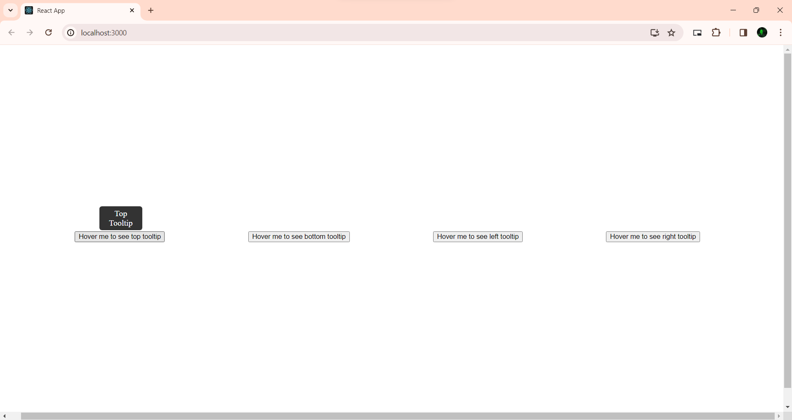
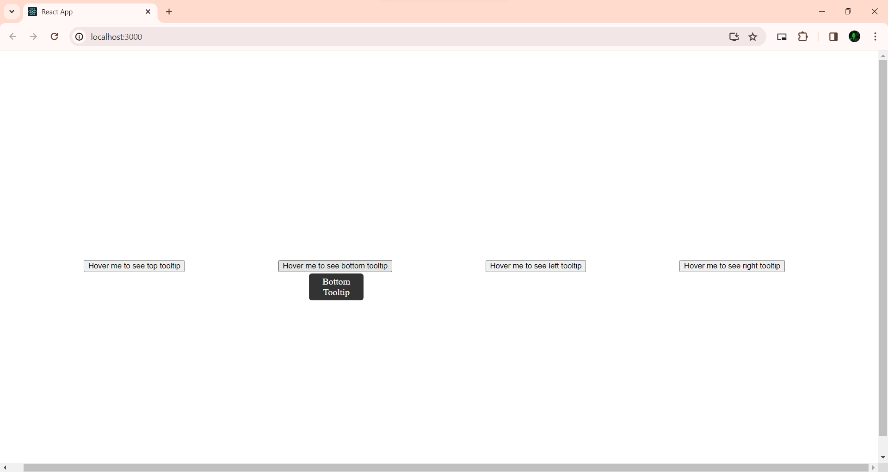
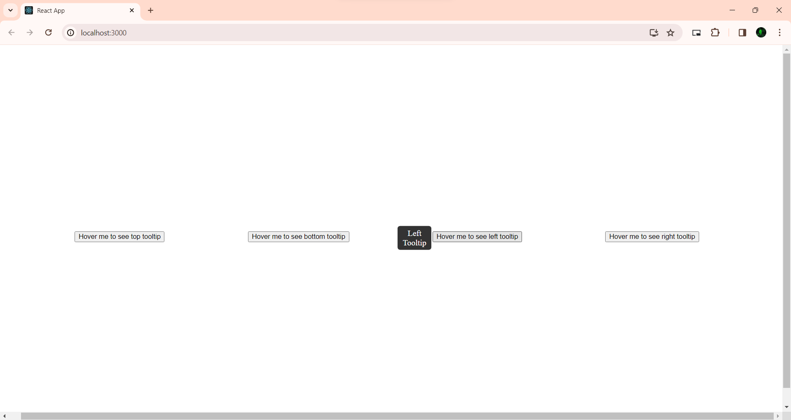
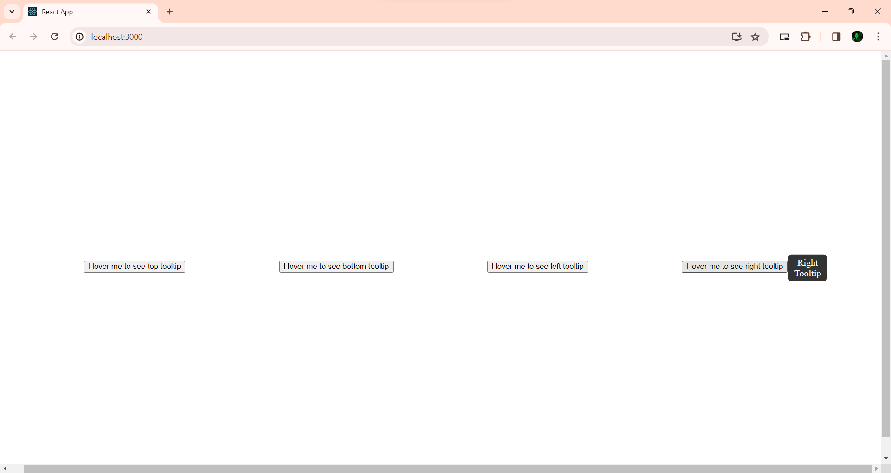

# React Tooltip

 <h1 align="center">React Tooltip 💬</h1> 

 🖊️ An interface for showing tooltip when hovering on a button 
     This App built using <a href="https://react.dev/">React</a>.

## Table of contents

-   [Features](#Features)
-   [Screenshot](#Screenshots)
-   [Setup](#Setup)
-   [Author](#author)
-   [Deploy Link](#deployed-link)

## Features

-   On hovering of the button it shows a tooltip.
-   The component receives the 'position' of tooltip as prop. We can pass options : “top”, “bottom”, “right”, “left”. According to the position the tooltip renders at that position.

## Screenshots

-   **Top Tooltip** 
    

-   **Bottom Tooltip** 
    

-   **Left Tooltip** 
    

-   **Right Tooltip** 
    

## Setup

1. Clone this repository.
2. Install dependencies: `npm install`.
3. Start the server: `npm start`.

### Viewing the Project

1. Open your browser and go to [http://localhost:3000/](http://localhost:3000/) to view the project.

## Author

-   [Subha Biswal](https://github.com/20SB)

## Deployed Link

-   [React Tooltip](https://tootltip-react-b7zgzc9pm-20sb.vercel.app/)
